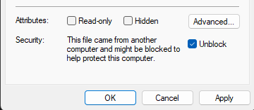

# Chocolatey

This is a guided script to install and config chocolatey and deploy packages with chocolatey.

🪟This deployment solution was tested on:

* ✅ Windows 10
* ✅Windows 11
* ✅Windows 11 Sandbox
* ✅Windows Server 2019
* ✅Windows Server 2022
* ✅Windows Server 2022 vNext (Windows Server 2025)

## ⚒️Step 1: Deploy Chocolatey

```
./Chocolatey_Deploy
```

The script does the following:

    1. Checks whether chocolatey is already installed.

    - Terminates the script if it is so as to avoid misconfiguring.

    2. If it isn't installed yet, it install chocolatey.

    3. Verifies if installation has been succesfull

    4. Configures the default repository as per set parameters (see below)

    5. Sets an auto-update configuration

    6. Installs a package cache cleaning utility

    7. Installs the Chocolatey GUI tool

### 📦Custom Source Settings

The script comes with 4 optional parameters:

- LocalRepository
  - (Optional)
  - Enables a local repository.
  - Leave blank to use the Chocolatey Community Repository.
  - Note that using the Community Repository can run you into traffic limits in a multi-machine deployment scenario.
- LocalRepositoryPath
  - (Optional)
  - Specifies the full FQDN or IP, port and path of the local repository.
- LocalRepositoryName
  - (Optional)
  - Specifies the name of the local repository.
- DisableCommunityRepository
  - (Optional)
  - Allows disabling the Community Repository entirely.
  - This will only work if a valid local repository has been added.
  - Usually there should be no need to use this unless you're specifically concerned about the security of packages from outside your organisation.

Examples of how to run the script with custom source settings:

```
./Chocolatey_Deploy $True "http://10.10.10.1:8624/nuget/Thoth/" "THOTH" $False
  
```

OR

```
./Chocolatey_Deploy $True "http://hercules.cerberus.local:8624/nuget/Hercules/" "HERCULES" $False
```

- The exact port and form of the path for the local repository will depend on the repository software you are using.

### 🌐Deploy Script via Network

If you want to quickly get Chocolatey installed and configured without downloading the script, run the below commands to download and run the script:

```
$scriptPath = "https://raw.githubusercontent.com/gabriel-vanca/Chocolatey/main/Chocolatey_Deploy.ps1"
$WebClient = New-Object Net.WebClient
$deploymentScript = $WebClient.DownloadString($scriptPath)
$deploymentScript = [Scriptblock]::Create($deploymentScript)
Invoke-Command -ScriptBlock $deploymentScript -ArgumentList ($False, "", "", $False) -NoNewScope
```

### ⚠️Troubleshooting: Running Scripts is Disabled

You might encounter the following error on Windows 10/11 system:

> *C:\temp\.\Script.ps1 cannot be loaded because running scripts is disabled on this system. For more information, see about_Execution_Policies at https://go.microsoft.com/fwlink/?LinkID=135170*

Run the following to solve this problem:

```
Set-ExecutionPolicy RemoteSigned
```

The `RemoteSigned` execution policy is the default policy on Windows Server deployments. 

* It requires a digital signature from a trusted publisher on scripts and configuration files that are downloaded from the internet.
* It doesn't require digital signatures on scripts that are written on the local computer and not downloaded from the internet. Any unblocked scripts downloaded from the internet are treated as local scripts and therefore do not require a trusted signature.

You will need to also make sure you have unblocked any scripts you are running (see below instructions on how to do that). This is only necessary if you download the files directly from GitHub through a web browser. Using the `Deploy Script via Network` method above does not mark the scripts downloaded from GitHub as blocked. Same is true if you just copy+paste the script into your terminal window.

Alternatively, you can set your execution policy temporarily to Bypass for the current terminal session. This will not block anything that runs in the current shell session and therefore will not require you to unblock anything.

```
Set-ExecutionPolicy Bypass -Scope Process
```

### ⚠️Troubleshooting: Script is Blocked

Files downloaded from the internet via a web browser are typically marked as blocked. That means that the RemoteSigned execution policy will expect them to be signed in order for them to be run. However, by unblocking them, they will be treated as scripts written locally and therefore not requiring a trusted signature.

The best method to unblock the files is by unblocking the .zip archive immediately after downloading it from GitHub and before extraction:

```
Unblock-File -Path "D:\Downloads\Chocolatey.zip"
```

Alternatively, you can unblock the files after extraction recursively:

```
Get-ChildItem "D:\Downloads\Chocolatey" -recurse | Unblock-File
```

You can also unblock the archives/the extracted files from the Properties menu by ticking the Unblock option and clicking OK or Apply:



## 🔐Step 2: Deploy Local Chocolatey Repository (Optional)

Using the Community Repository can run you into traffic limits in a multi-machine deployment scenario.

For that reason, as well as security, licensing and IP protection, you might decide to deploy your own local Chocolatey repository.

In the examples above, the repository software used is the Inedo ProGet free software.

* https://inedo.com/proget
* Inedo ProGet can be deployed on Windows (including Windows Server with a free ProGet license), as well as Linux Docker containers.
* The packages can be stored locally or on an SMB/NFS network share.
  * ⚠️Please make sure sufficient storage is available.
* ProGet can install its own SQL Express database, or be configured with an external SQL database such as the free edition of Windows SQL Server.
* The paid Inedo ProGet versions also support retention policies, LDAP/AD Integration, Load Balancing, High Availability & Automatic Failover, Multi-Site Replication and AWS/Azure Packet Cloud Storage.

## 🚇Step 3: Deploy Packets using Chocolatey

A demo .ps1 script has been included with this project to showcase how Chocolatey can be used to deploy packages, as well as how to connect to a local repository if one is present.

```
./Chocolatey_Demo
```

The demo script will:

1. Install and configure Chocolatey
   * therefore make sure it is not yet installed
2. Connect it to a local repository if so indicated in the prompts
3. Installs a set of "Core" apps (zip archivers, git, dropbox etc), including as set of OS-purpose-selected (consumer vs Server) packages
4. Installs a set dedicated apps for Server/NAS/Workstation/Laptop/Gaming, depending on the enviroment selected during the demo prompts.

⚠️REMINDER: The Chocolatey_Demo.ps1 is a demo script of how to install and configure Chocolatey using the deploy script (Chocolatey_Deploy.ps1) and then use Chocolatey to install software. You HAVE TO download and configure Chocolatey_Demo.ps1 as you require it or fork the repo and edit as needed. Chocolatey_Demo.ps1 is purely for demonstrative purposes. ⚠️
